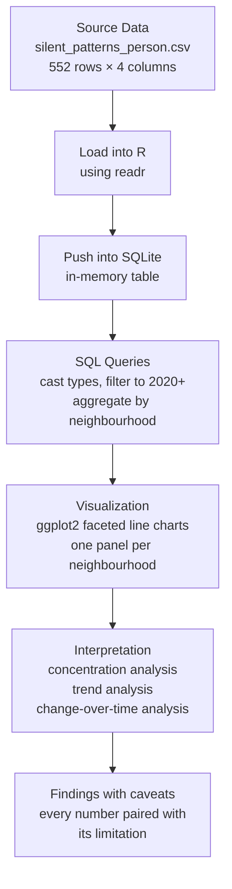

<div align="center">

# Silent Patterns

*A project that started with "which Vancouver neighbourhoods have the most crime" and ended with a lesson about why counting incidents without counting people gives you a story that sounds true but is not complete.*

[](https://github.com/Sahibjeetpalsingh/silent-patterns)
[](https://github.com/Sahibjeetpalsingh/silent-patterns)
[](https://github.com/Sahibjeetpalsingh/silent-patterns)
[](LICENSE)

</div>

<br>

## See the Output

<p align="center">
  
</p>

Twenty-four neighbourhoods. Twenty-two years of data. 552 observations. The Central Business District alone accounts for 30.3% of all recorded incidents in this dataset, more than the next two neighbourhoods combined. That concentration is the first finding, and the one that shapes every question that follows.

<br>

---

## The Starting Point: A Specific Question, Not a Vague Exploration

I did not open this dataset and ask "what patterns exist." I started with a question that has a clear answer or a clear reason it cannot be answered yet.

**How have Offence Against a Person incidents changed across Vancouver neighbourhoods over time, and which areas show the highest concentration in the most recent years?**

That question sounds simple. It is not. Answering it honestly requires knowing what the data actually measures, what it leaves out, and where the numbers might mislead someone who reads them without context.

<br>

---

## Chapter 1: Before the Code, the Thinking

### Who would use this analysis?

A city planner looking at where to allocate community safety resources. A policy analyst evaluating whether intervention programs in specific neighbourhoods are working. A journalist writing about crime trends who needs numbers that are accurate and properly caveated.

Each of those audiences would ask different follow-up questions, but all of them need to trust the base numbers first. That trust starts with being transparent about what this data can and cannot tell you.

### What does "incident count" actually mean here?

This is the most important question and the one that most analyses of this kind skip entirely.

The dataset records the number of reported Offence Against a Person incidents per neighbourhood per year. That is a **count**, not a **rate**. The difference matters enormously.

The Central Business District has the highest incident count in the dataset. It also has one of the highest daytime populations in Vancouver because of office workers, tourists, transit users, and foot traffic. If you have more people in a space, you will have more incidents in that space, even if the per-person risk is the same as or lower than a quieter neighbourhood.

Without a population denominator, you cannot say "the Central Business District is more dangerous." You can only say "more incidents are reported there." Those are two different statements, and conflating them is exactly how misleading crime narratives get built.

> **This entire analysis operates on counts, not rates.** Every finding carries that caveat. A rate calculation would require neighbourhood-level population data, and that data is not included in this dataset.

### What could go wrong with this data?

Before writing any code, I checked for the things that would silently break the analysis.

| Problem | What I found | Why it matters |
|:---|:---|:---|
| Incomplete latest year | 2025 total is lower than 2023 and 2024 | Could reflect a real decline or could mean the source export was pulled before the year ended. Cannot tell without confirming the extraction date. |
| Single crime category | Only "Offence Against a Person" is included | This is not a total crime analysis. Findings apply to one category only. |
| Annual aggregation | Data is yearly, not monthly | Seasonal patterns (summer spikes, winter drops) are completely hidden. A neighbourhood could have a dangerous three-month stretch that is invisible in annual totals. |
| No population data | Counts only, no per-capita normalization | High-traffic areas will always show higher counts regardless of actual risk. Cross-neighbourhood comparisons are descriptive only. |

<br>

---

## Chapter 2: Five Analytical Questions

I defined these before running any queries. Each one has a clear structure: what am I looking for, what would the answer look like, and what would make the answer unreliable.

| # | Question | What a good answer looks like | What could make it unreliable |
|:---:|:---|:---|:---|
| Q1 | Which neighbourhoods contribute the largest share of reported incidents? | A ranked list with percentage share, not just raw counts | High counts could reflect population density, not higher risk |
| Q2 | How has the city-level trend changed from 2003 to 2025? | A time series showing direction and magnitude of change | Reporting practices may have changed over 22 years |
| Q3 | Which neighbourhoods remain consistently high-volume over time? | Neighbourhoods that appear in the top tier across multiple years, not just one spike | A single bad year could make a neighbourhood look consistently dangerous |
| Q4 | Which neighbourhoods increased or decreased the most since 2020? | Absolute and relative change so a small neighbourhood with a large percentage jump is not hidden | Post-COVID reporting changes could affect comparisons |
| Q5 | Does the latest year indicate a real decline, or could it reflect incomplete reporting? | A clear statement about data completeness with a recommendation on whether to include 2025 in conclusions | If the export date is unknown, the answer is "we cannot tell" |

A more detailed interview-ready version of these questions is in [ANALYSIS_QUESTIONNAIRE.md](ANALYSIS_QUESTIONNAIRE.md).

<br>

---

## Chapter 3: The Methodology

The workflow follows the sequence a working analyst would use: load, query, visualize, interpret. No step is skipped and no step is done out of order.



### Why SQL inside an R script?

Because the analysis needs to be reproducible and the queries need to be readable. Writing the filtering and aggregation logic in SQL means anyone who knows SQL can verify exactly what was included and excluded. Wrapping it in R means the visualization is one script away from the query, not a separate tool with a manual export step in between.

### Why faceted line charts?

Because 24 neighbourhoods on a single line chart is unreadable. Faceting gives each neighbourhood its own panel with a shared y-axis so the scale comparisons are honest. You can see at a glance which neighbourhoods have flat lines (stable), which have upward slopes (growing), and which have recent drops that might or might not be real.

<br>

---

## Chapter 4: What the Data Actually Shows

### The concentration is extreme.

The Central Business District recorded **25,589 incidents** across the full dataset, representing **30.3%** of all recorded incidents. Strathcona follows with **11,072** (13.1%) and the West End with **9,264** (11.0%). Together, those three neighbourhoods account for over half of all incidents in the dataset.

That concentration is not surprising if you think about it. These are the highest-traffic, highest-density areas in Vancouver. But the degree of concentration is worth stating clearly because it means that city-level totals are dominated by what happens in a very small number of places. A 10% increase in the CBD moves the city-wide number more than a 50% increase in Musqueam.

### The city-level trend peaked in 2007, dipped, and climbed back.

The highest annual total in the full dataset is **2007 with 4,406 incidents**. Totals dropped through the early 2010s, then climbed steadily through the late 2010s. In the post-2020 window used for the chart, **2023 is the high point with 4,074 incidents**. The 2024 and 2025 totals are lower.

### The 2025 number needs a caveat before anyone uses it.

The 2025 total is lower than 2023 and 2024. That could mean incidents are genuinely declining. It could also mean the data extract was pulled before the year was complete. Without confirming the extraction date of the source file, the responsible thing to do is flag it as potentially incomplete and not include it in any trend conclusion.

> **This is the kind of detail that separates an analysis people trust from one that gets challenged in a meeting.** "Crime is down in 2025" is a headline. "The 2025 total is lower but we have not confirmed whether the extract covers the full year" is an analyst statement. They sound different. One of them survives scrutiny.

### Some neighbourhoods are consistently high. Others spike and settle.

The CBD, Strathcona, and West End appear in the top tier in almost every year. They are not having bad years. They are structurally high-volume areas. Other neighbourhoods like Grandview-Woodland or Mount Pleasant show more variation, with periods of increase followed by stabilization. That distinction matters for resource allocation: a consistently high area needs sustained investment, not a reactive surge.

<br>

---

## Chapter 5: What This Data Cannot Tell You

| # | Limitation | What it means in practice |
|:---:|:---|:---|
| L1 | No population denominator | You cannot say a neighbourhood is "more dangerous." You can only say more incidents are reported there. High foot traffic areas will always show higher counts. |
| L2 | Single crime category | This covers Offence Against a Person only. Property crime, drug offences, and other categories are not included. The picture is partial. |
| L3 | Annual aggregation hides seasonality | A neighbourhood could have a severe three-month spike that disappears when averaged across twelve months. Monthly data would reveal patterns this analysis cannot. |
| L4 | 2025 may be incomplete | The latest year's total is lower, but without confirming the source extraction date, it is impossible to know whether this reflects a real decline or a truncated reporting window. |
| L5 | Reporting practices change over time | How incidents are recorded, categorized, and reported may have changed across 22 years. A trend that looks like "more crime" could partly reflect "more reporting." |
| L6 | No causal information | This analysis describes where and when incidents happen. It does not explain why. Causation would require demographic, economic, and policing data that is not in this dataset. |

> **Why this section exists:** Because presenting findings without limitations is not analysis, it is advocacy. Every number in this project is paired with what it cannot tell you, so the reader can decide how much weight to give it.

<br>

---

## The Dataset

**Source:** Vancouver Open Data (filtered to Offence Against a Person)
**File:** `data/silent_patterns_person.csv`
**Scope:** 2003 to 2025

| Dimension | Coverage |
|:---|:---|
| Neighbourhoods | 24 |
| Years | 2003 to 2025 (22 years) |
| Total rows | 552 |
| Crime category | Offence Against a Person (single category) |

### Columns

| Column | Description |
|:---|:---|
| `neighbourhood` | Vancouver neighbourhood name |
| `year` | Reporting year |
| `incident_count` | Annual count of reported incidents |
| `level` | Count band used in the source extract |

<br>

---

## Repository Structure

```
silent-patterns/
│
├── data/
│   └── silent_patterns_person.csv     Input dataset
│
├── scripts/
│   └── plot_silent_patterns.R         SQL + visualization workflow
│
├── output/                            Generated charts (git-ignored)
│   └── vancouver_offence_against_person_trends.png
│
├── ANALYSIS_QUESTIONNAIRE.md          Stakeholder and analytical question set
└── README.md                          This file
```

<br>

---

## Tools Used

| Tool | What it does in this project | Why this, not something else |
|:---|:---|:---|
| **R** | Scripting and orchestration | Handles the full workflow (data load, SQL execution, visualization) in one script without switching tools |
| **SQLite** | Analytical querying | Lightweight, embedded, no server setup. The SQL is readable and verifiable by anyone. |
| **ggplot2** | Faceted trend charts | The faceting system handles 24 neighbourhood panels cleanly with shared axes for honest scale comparisons |
| **readr** | CSV ingestion | Clean, fast, predictable type parsing |

<br>

---

## How to Run

Install the required R packages:

```r
install.packages(c("DBI", "RSQLite", "readr", "ggplot2"))
```

Run from the project root:

```r
source("scripts/plot_silent_patterns.R")
```

Or from a terminal:

```bash
Rscript scripts/plot_silent_patterns.R
```

The chart is saved to `output/vancouver_offence_against_person_trends.png`.

<br>

---

## What I Would Do Differently

Four things would make this analysis meaningfully stronger.

First, add neighbourhood population data to calculate per-capita rates. This is the single biggest improvement. Without it, every cross-neighbourhood comparison carries the caveat that counts reflect density and foot traffic, not necessarily risk. Statistics Canada census data at the dissemination area level could be mapped to Vancouver neighbourhoods to produce proper rates.

Second, expand to multiple crime categories. Offence Against a Person is one slice. Property crime, break and enter, vehicle theft, and drug offences each have their own spatial patterns. A multi-category view would show whether the same neighbourhoods dominate across all types or whether concentration shifts by category.

Third, move from annual to monthly data. Seasonality is invisible at the yearly level. Monthly data would reveal whether summer months drive the totals, whether holiday periods show spikes, and whether the 2025 drop is happening evenly or is concentrated in specific months.

Fourth, build a dashboard layer. The current output is a static chart. An interactive Power BI or Shiny dashboard with neighbourhood filters, year range sliders, and category selectors would let a stakeholder explore the data instead of just reading a conclusion.

<br>

---

<div align="center">

**Sahibjeet Pal Singh**

[GitHub](https://github.com/Sahibjeetpalsingh) · [LinkedIn](https://linkedin.com/in/sahibjeet-pal-singh-418824333) · [Portfolio](https://sahibjeetpalsingh.netlify.app/)

*Vancouver crime incident analysis across 24 neighbourhoods (2003 to 2025). Built with R, SQL, and ggplot2.*

</div>
